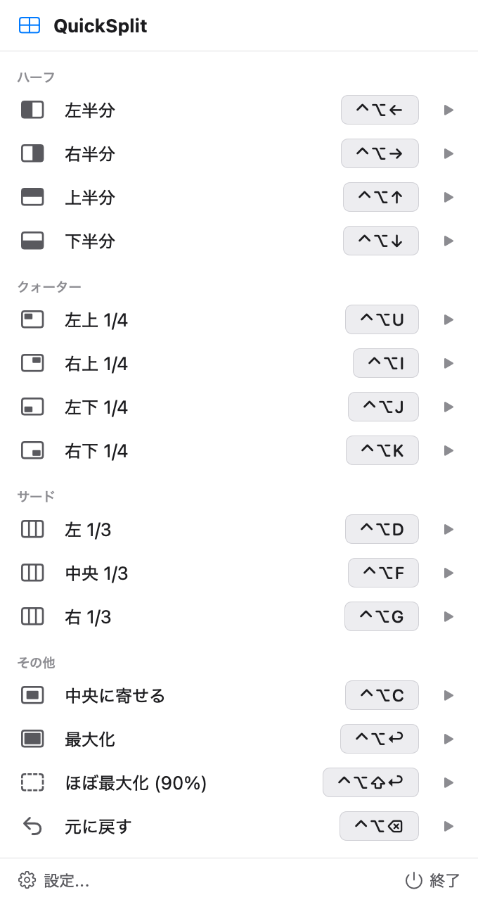

# QuickSplit

macOS 用の画面分割ショートカットマネージャ。menu bar に常駐し、ウィンドウを左右半分・4分割・3分割・中央・最大化などに一発で整列するグローバルホットキーを、GUI で自由に編集できます。

Rectangle / Magnet 相当の機能を、SwiftUI ネイティブで軽量に実装したものです。

<p align="center">
  <picture>
    <source media="(prefers-color-scheme: dark)" srcset="docs/screenshots/popover-dark.png">
    
  </picture>
</p>

## 機能

- **14種の分割アクション**: 左右半分 / 上下半分 / 4分割 / 横3分割 / 中央寄せ / 最大化 / ほぼ最大化 / 元に戻す
- **menu bar アイコンから設定を即起動**: クリック一発で全ショートカットの編集&即実行画面へ
- **ユーザー編集可能なホットキー**: 任意のキーコンビネーションを割り当て、永続化
- **ログイン時起動**: 設定からトグル
- **マルチディスプレイ対応**: ウィンドウが載っているスクリーン基準で計算

## インストール

### 要件
- macOS 14 (Sonoma) 以上
- Apple Silicon / Intel Mac（リリースビルドは現在のホスト CPU 向け）

### 方法A: Releases の .zip からインストール

1. [Releases](https://github.com/YukiYasui/quicksplit/releases) から `QuickSplit.app.zip` をダウンロード
2. 解凍して `QuickSplit.app` を `/Applications/` へ移動
3. **ターミナルで quarantine 属性を解除**（これを忘れるとアイコンクリックで消える不具合が起きます）
   ```bash
   xattr -dr com.apple.quarantine /Applications/QuickSplit.app
   ```
4. `open /Applications/QuickSplit.app`

### 方法B: ソースからビルド

```bash
git clone https://github.com/YukiYasui/quicksplit.git
cd quicksplit
./build.sh release
open dist/QuickSplit.app
```

`dist/QuickSplit.app` を `~/Applications` 等へコピーすれば常用できます。

## リリース手順（メンテナ向け）

> **鉄則: 必ず `git tag` を切ってから `./build.sh` を実行する。**
> marketing version (`CFBundleShortVersionString`) は `build.sh` が `git describe --tags` で
> タグから自動注入する。タグが無い／古いままビルドすると過去バージョンが焼き込まれる
> （実際に実体 0.2.0 を 0.1.0 表記のまま配布してしまう事故が起きた）。

新バージョン `X.Y.Z` を出す手順:

1. `Resources/Info.plist` の `CFBundleVersion` を +1。これは Sparkle の更新判定キーで、
   marketing version と違い**手動管理**（`appcast.xml` の `sparkle:version` と一致させる）
2. `appcast.xml` に新しい `<item>`（`sparkle:version` = 手順1の値、`shortVersionString` = `X.Y.Z`）を追加
3. `git commit` → `git tag vX.Y.Z` → `git push origin main` → `git push origin vX.Y.Z`
4. `./build.sh release`（タグから `X.Y.Z` を Info.plist に注入。安定署名証明書で署名）
5. zip 化:
   ```bash
   ditto -c -k --sequesterRsrc --keepParent dist/QuickSplit.app dist/QuickSplit-X.Y.Z-arm64.zip
   ```
6. EdDSA 署名を生成して `appcast.xml` の該当 item の `edSignature` / `length` を更新し commit & push:
   ```bash
   .build/artifacts/sparkle/Sparkle/bin/sign_update dist/QuickSplit-X.Y.Z-arm64.zip
   ```
7. GitHub Release を作成し、手順5の zip をアップロード（appcast の `enclosure url` と一致させる）

**初回のみ**: 安定署名証明書を作成（リビルドしても Accessibility 権限が維持される）
```bash
./scripts/create-signing-identity.sh
```

## Accessibility 権限の付与

ウィンドウを操作するため、macOS の Accessibility API への許可が必要です。

1. QuickSplit を起動し、menu bar の `▣` アイコンをクリックして設定画面を開きます
2. **一般** タブの「Accessibility 未許可」表示の右にある「設定を開く」ボタンから System Settings → **プライバシーとセキュリティ** → **アクセシビリティ** が開きます
3. QuickSplit のトグルを ON にします
4. 設定画面の表示が「Accessibility を許可済み」に変われば完了（数秒で自動反映）

## 使い方

1. menu bar の `▣` アイコンをクリック → 設定画面が開く
2. **ショートカット** タブで各行の録音フィールドをクリックしてホットキーを割り当て
3. 割り当てたキーを押すとフォーカス中のウィンドウが分割される
4. 行右端の ▶︎ ボタンでその場で実行もできる
5. 「元に戻す」は直前のフレームへ復元（履歴 20 回まで）
6. 終了するときは **一般** タブの「QuickSplit を終了」ボタン

## アーキテクチャ

- **Swift Package** (`Package.swift`) — 単一 executable target
- **`Sources/QuickSplit/Core/`**
  - `WindowAction.swift` — 全分割アクションの enum と表示メタデータ
  - `WindowLayoutCalculator.swift` — スクリーン矩形 → 目標フレーム計算（純粋関数）
  - `WindowManager.swift` — AXUIElement で最前面ウィンドウをリサイズ、履歴管理
  - `AccessibilityGuard.swift` — AX 権限チェック + 設定誘導
  - `ShortcutRegistry.swift` — [KeyboardShortcuts](https://github.com/sindresorhus/KeyboardShortcuts) への登録
- **`Sources/QuickSplit/Views/`** — SwiftUI（Settings ウィンドウ。menu bar アイコンは AppKit `NSStatusItem` 実装）
- **`Resources/Info.plist`** — `LSUIElement=true` で Dock に出さない
- **`build.sh`** — `swift build` → .app バンドル組み立て（Sparkle.framework 同梱・rpath 設定）→ git タグから marketing version 注入 → 安定した自己署名証明書で署名（証明書が無ければ ad-hoc にフォールバック）
- **`scripts/create-signing-identity.sh`** — 安定署名用の自己署名コード署名証明書を login keychain に冪等生成

## 依存

- [sindresorhus/KeyboardShortcuts](https://github.com/sindresorhus/KeyboardShortcuts) (MIT)

## ライセンス

MIT
